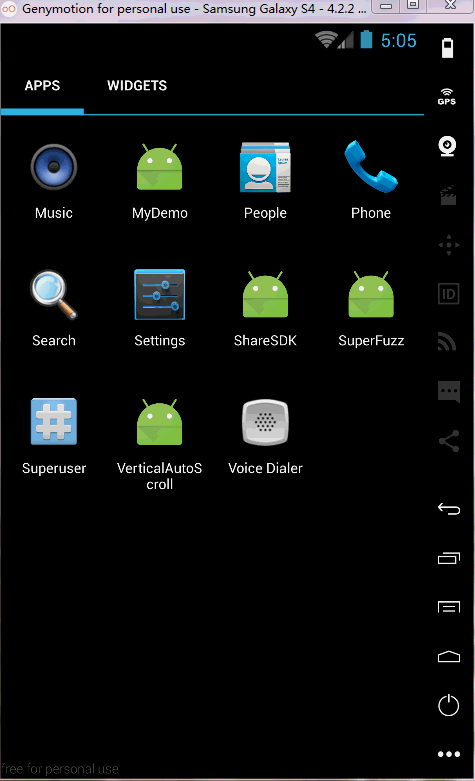
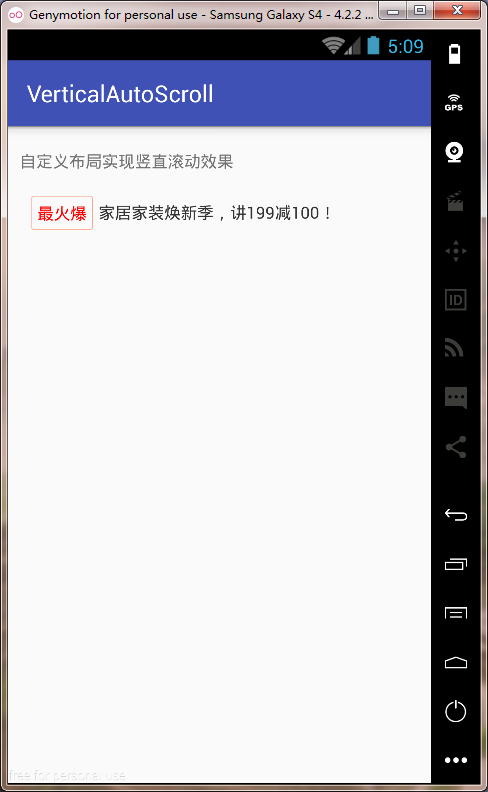

# VerticalAutoScroll
Vertical auto scroll View. 仿京东，淘宝，竖直自动轮播view。

# 效果

# Gradle
	//使用 autoplay viewpager
	compile ('com.xyzlf.autoplay.view:verticalplay:0.0.1') {
	    exclude group: 'com.android.support', module: 'appcompat-v7'
	}

# 使用方式

1、在xml中使用，如下：

	<!-- 自定义布局实现 -->
    <com.xyzlf.vertical.autoscroll.VerticalScrollView
        android:id="@+id/vertical_scroll_view"
        android:layout_width="match_parent"
        android:layout_height="wrap_content"
        custom:intervalDuration="4000"
        custom:animDuration="1000"/>

	<!-- ViewFlipper实现 -->
    <ViewFlipper
        android:id="@+id/flipper"
        android:layout_width="match_parent"
        android:layout_height="50dp"
        android:flipInterval="4000"
        android:inAnimation="@anim/push_up_in"
        android:outAnimation="@anim/push_up_out">
	<!-- 在这里添加view即可，比较简单 -->
	</ViewFlipper>

2、代码中使用：

	List<ItemData> datas = new ArrayList<>();
	datas.add(new ItemData("瑞士维氏军刀 新品满200-50","最新"));
	datas.add(new ItemData("家居家装焕新季，讲199减100！","最火爆"));
	datas.add(new ItemData("带上相机去春游，尼康低至477","HOT"));
	datas.add(new ItemData("价格惊呆！电信千兆光纤上市","new"));
	
	final MyScrollAdapter adapter = new MyScrollAdapter(datas);
	final VerticalScrollView tbView = (VerticalScrollView) findViewById(R.id.vertical_scroll_view);
	tbView.setAdapter(adapter);
	//开启线程滚东
	tbView.start();

3、Adapter需要继承 **VerticalScrollAdapter<T>**，完整Adapter代码如下：

	public class MyScrollAdapter extends VerticalScrollAdapter<ItemData> {

	    public MyScrollAdapter(List<ItemData> mDatas) {
	        super(mDatas);
	    }
	
	    @Override
	    public View getView(VerticalScrollView parent) {
	        return LayoutInflater.from(parent.getContext()).inflate(R.layout.layout_item, parent, false);
	    }
	
	    @Override
	    public void setItem(final View view, final ItemData data) {
	        TextView tv = (TextView) view.findViewById(R.id.content);
	        tv.setText(data.content);
	        TextView tag = (TextView) view.findViewById(R.id.tag);
	        tag.setText(data.tag);
	        //你可以增加点击事件
	        view.setOnClickListener(new View.OnClickListener() {
	            @Override
	            public void onClick(View v) {
	                Toast.makeText(view.getContext(), data.tag, Toast.LENGTH_SHORT).show();
	            }
	        });
	    }
	}

# 关于我
有任何使用问题，可以给我发邮件：

Author：张利峰

E-mail：519578280@qq.com

# 参照

1、自定义View去实现竖直轮播。

2、用ViewFlipper实现竖直轮播。

以上两点思路参照该文章：
<http://blog.csdn.net/u013278099/article/details/50934697>

3、用listView实现，竖直自动轮播思路。

csdn: <http://blog.csdn.net/hai_qing_xu_kong/article/details/51013562>

github：<https://github.com/LinhaiGu/ASUpAdvertisementArticle>

4、孙福生用ViewFlipper的思路，封装了一个，挺不错的：<https://github.com/sfsheng0322/MarqueeView>

5、一个帮您快速实现跑马灯效果的library：<https://github.com/gongwen/MarqueeViewLibrary>

6、A periodic text updating library：<https://github.com/sdsmdg/RotatingText>

# License

    Copyright(c) 2016 xyzlf Open Source Project

    Licensed under the Apache License, Version 2.0 (the "License");
    you may not use this file except in compliance with the License.
    You may obtain a copy of the License at

    http://www.apache.org/licenses/LICENSE-2.0

    Unless required by applicable law or agreed to in writing, software
    distributed under the License is distributed on an "AS IS" BASIS,
    WITHOUT WARRANTIES OR CONDITIONS OF ANY KIND, either express or implied.
    See the License for the specific language governing permissions and
    limitations under the License.
